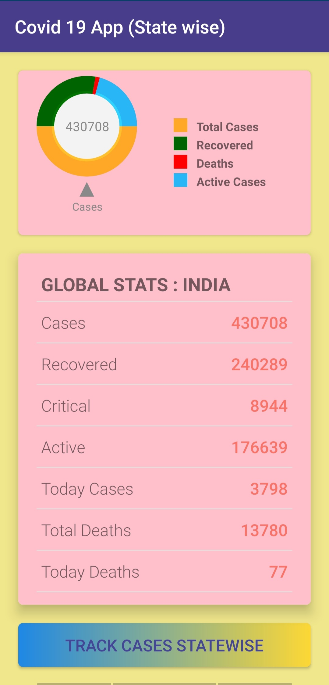
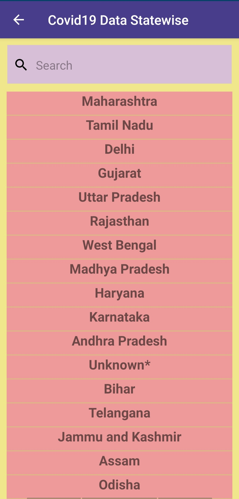
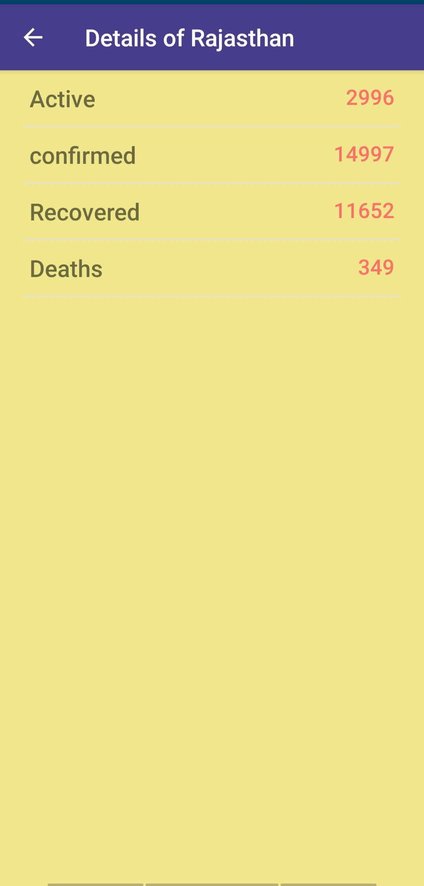

# Covid19-App-Statewise
An android application for Showing Covid19 cases of Indian states.

## Features
- Show the total cases of covid 19 statewise.
- Show Recovered cases ,Active Cases,Deaths etc Statewise.
- Use of ListView And the adapter class to fetch the data from the api.

## Api Used are :-
  - An Android chart and graph library  https://github.com/blackfizz/EazeGraph
    
  - An image loading and caching library for Android focused on smooth scrolling  https://bumptech.github.io/glide/
    
  - Volley is an HTTP library that makes networking for Android apps easier and, most importantly, faster https://developer.android.com/training/volley/index.html
    
 ## APPLICATION DISPLAY
<abc></abc>
<abc></abc>
<abc></abc>

### Prerequisites
What things you need to install the software and how to install them

```
- Android Mobile
- Android Studio
- Knowledge of Java 
  That's it!
```
## Installing

A step by step series of examples that tell you how to get a development environment running :exclamation:

Say what the step will be
```
You can Download the application using below link-
https://github.com/Ashish-sah/Covid19-App-Statewise
```
## Apk Link
https://github.com/Ashish-sah/Covid19-App-Statewise/blob/master/apk/debug/app-debug.apk

## Built With Love
* Android Studio
* Java

## Contributing

All contributions  are welcomed .

## Author
* **Ashish Sah** - https://www.linkedin.com/in/ashish-sah-943171160/
